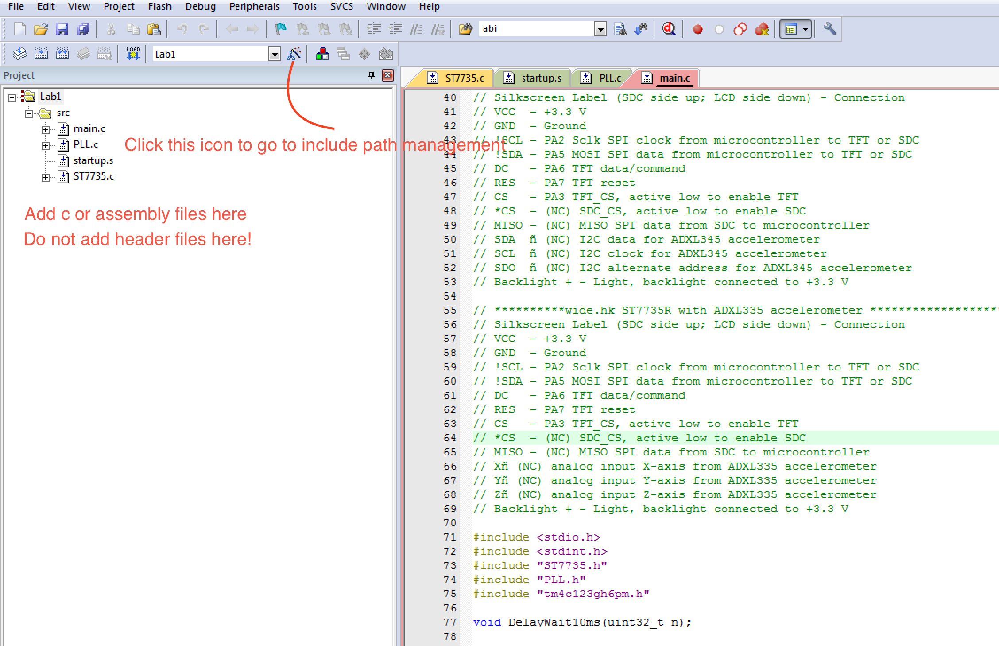
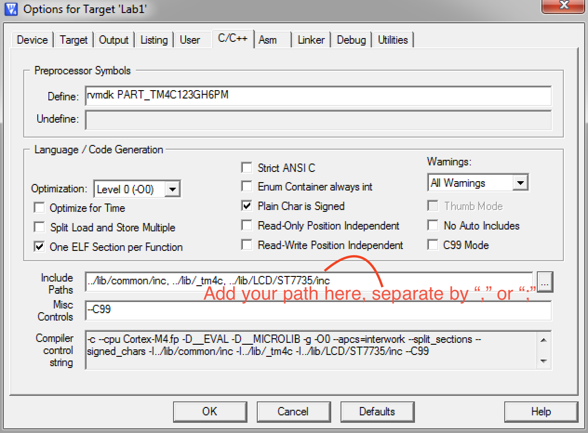

# EE445L

We have this repository, in order to let you have better source code management. Not throwing c, h files into the same folder. You should put your reusabe code into lib folder and probably only keeps one main file in your project folder.

This is what we had:

```c
#include "../inc/tm4c123gh6pm.h"
```

not pretty, we would love to just put tm4c123gh6pm.h after include like:

```c
#include "tm4c123gh6pm.h"
```

There are 2 ways to make this happen:
1. Throw everything into the project folders, which is what we try to avoid.
2. Include path management. You should always manage your include path well in real work.

## Keil


This way, the compiler will look for header files in those paths you add.

## GCC
If you are using Linux/Mac OS, you have the option to use gcc tools with TM4C board, no more Keil.
Please refer to [Josh's tool](https://github.com/jishminor/ee445l-linux) or [zEEware](https://github.com/ZeeLivermorium/zEEware) for more details in installation, how to use and etc. I have currently added Makefiles similar to [zEEware](https://github.com/ZeeLivermorium/zEEware), since I like my file management better... 

